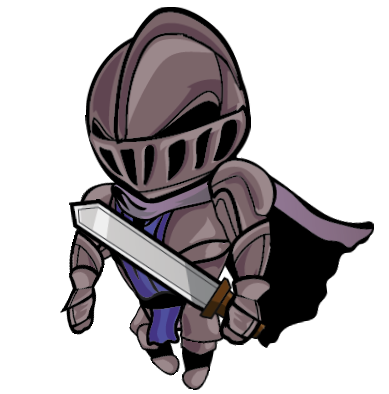
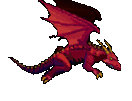
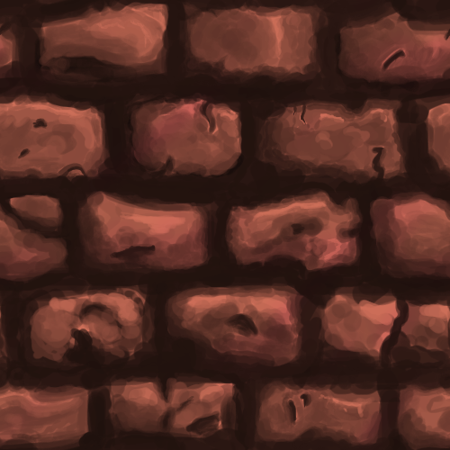
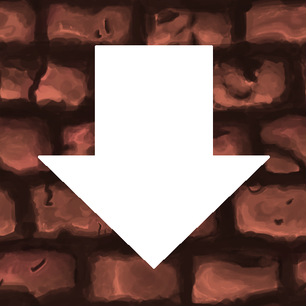

# RUN AND JUMP
- Họ và tên: Nguyễn Hùng Minh
- Mã sinh viên: 22028294
- Demo: 
# Giới thiệu game
Run and Jump thuộc thể loại game platformer chiều dọc, người chơi sẽ đóng vai chàng hiệp sĩ vượt chướng ngại vật để có thể thoát khỏi dung nham ở dưới đang trào lên.
# Mục lục
0.[Cách tải game](#0-Cách-tải-game)
1. [Bắt đầu game](#1-Bắt-đầu-game)
2. [Các thành phần trong game](#2-Các-thành-phần-trong-game)
3. [Cách chơi](#3-Cách-chơi)
4. [Nguồn tham khảo](#4-Nguồn-tham-khảo)
5. [Tài nguyên sử dụng](#5-Tài-nguyên-sử-dụng)

## 0. Cách tải game
đang hoàn thánh
## 1 . Bắt đầu game
Đây là màn hình khi vừa khởi động trò chơi, nhất enter để có thể bắt đầu 

## 2. Các thành phần trong game

- Hiệp sĩ/ người chơi
  
 
- Rồng
  

- Hơi lửa phun ra từ rồng
  
  
- Tảng đá/platform để người chơi có thể nhảy lên
- 
  
  
  

  ## 3. Cách chơi
  Người chơi ban đầu sẽ có 5 trái tim, mục tiêu của game là điều khiển chàng hiệp sĩ nhảy lên những tảng đá đồng thời tránh những hơi lửa của rồng trước khi dung nham bắt kịp. Nếu va chạm với hơi lửa sẽ mất 1 trái tim, hết toàn bộ 5 trái tim thì người chơi thất bại và game sẽ kết thúc, nếu va chạm với dung nham thì game sẽ kết thúc ngay lập tức. Người chơi sẽ chiến thắng nếu lên được đỉnh level trước khi dung nham bắt kịp và còn từ 1 trái tim trở lên.
  Các nút trong game:
- Di chuyển: Space (Nhảy), ← (Chạy sang trái), → (Chạy sang phải)
- ESCAPE: thoát game
- TAB: dừng game

## 4. Nguồn tham khảo
  https://lazyfoo.net/tutorials/SDL/
 https://www.youtube.com/watch?v=k1JGvJU707k&list=PLR7NDiX0QsfQQ2iFXsXepwH46wf3D4Y4C

## 5. Tài nguyên sử dụng
https://opengameart.org/content/knight-and-knight-animation
https://opengameart.org/content/handpainted-rock-walls
https://www.chosic.com/free-music/epic/
https://opengameart.org/content/fire-explode
https://opengameart.org/content/heart-1616
https://www.myinstants.com/en/instant/minecraft-damage-6455/
https://www.pngitem.com/middle/iihoxhi_transparent-you-win-png-transparent-you-win-text/

  

  

